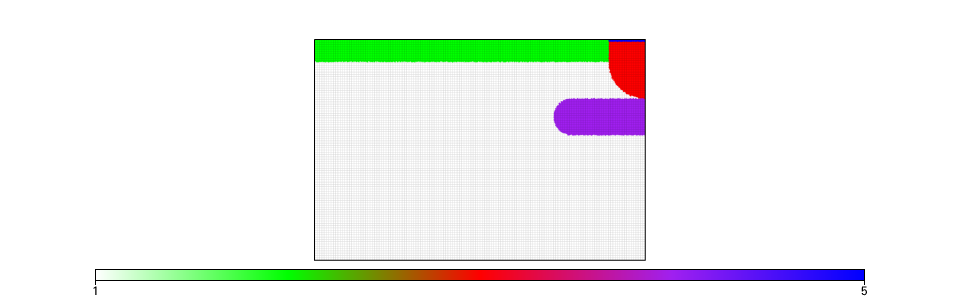
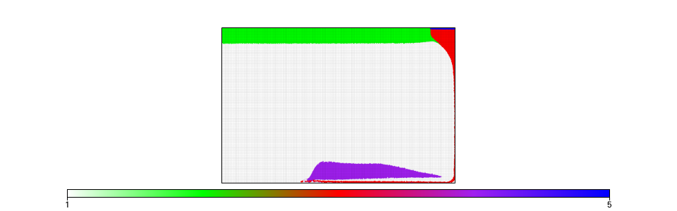

<table><tr><td></td><td></td></tr></table>

About
-----
This is an under-construction model studying gravity-driven delamination in planetary ice layers.

Files
-----
**_Please give a quick overview of purpose of the model files/directories included in this repo._**
**_Note that while light data files are fine,  heavy data should not be included in your repository._**

File | Purpose
--- | ---
`IceDripMasterScript.ipynb` | The model script file. 
`VrmsIceDrip.png`| Expected VRMS curve image. 
`InitialConditions.png` | Initial conditions image.
`FinalTimestep.png` | Expected final results image.

Tests
-----
In this stage of model construction, an acceptable test is if the vrms curve produced by running the notebook matches the vrms image provided above.

Parallel Safe
-------------

Yes, test result should be obtained in both serial and parallel operation.

Check-list
----------
- [X] (Required) Have you replaced the above sections with your own content? 
- [X] (Required) Have you updated the Dockerfile to point to your required UW/UWG version? 
- [X] (Required) Have you included a working Binder badge/link so people can easily run your model?
                 You probably only need to replace `template-project` with your repo name. 
- [X] (Optional) Have you included an appropriate image for your model? 
